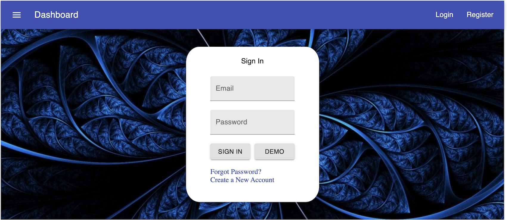

# Tech Stack

- Frontend UI is built using React.js
- Backend Server uses Node and Express.js
- MongoDB is used as the database management service  

# Login Page

- Authentication is supported using JSON Web Tokens 

- I am still currently working on the backend functionality for the bug tracking app